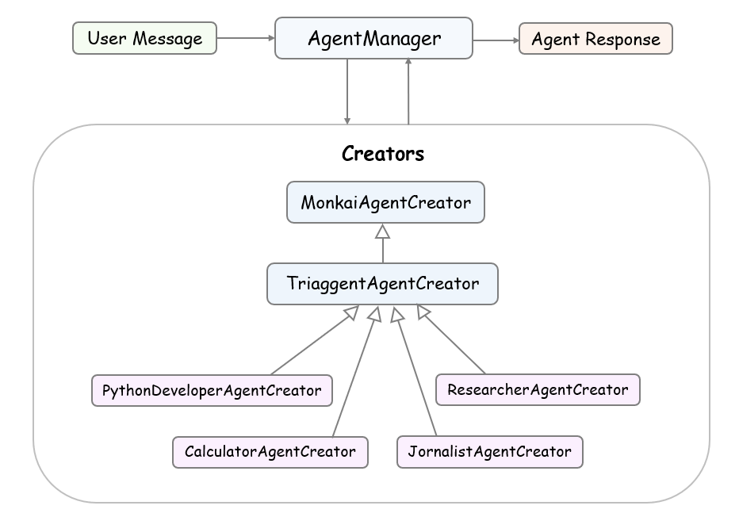

<h2 style="font-family: 'Courier New', monospace; color: green;"> MonkAI_agent</h2>

<h3 style="font-family: 'Courier New', monospace; color: green;"> The simple framework for creating intelligent agents, flows quickly, easily, and customizable.</h3>

  This is an innovative framework designed to facilitate the creation of intelligent agent flows, offering a simple and customizable approach to the development of autonomous agents.
    
  With this framework, you can create, manage, and optimize agents quickly and efficiently. Whether for specific tasks or more complex applications, it provides a modular base that adapts to your needs. Its simplicity of use, combined with its flexibility, makes it an ideal choice for both beginners and experienced developers.

<h3 style="font-family: 'Courier New', monospace; color: green;">Install</h3> 

Make sure you have Python 3.11 or higher installed on your system.

Clone this repository:

<pre style="background-color: #f6f8fa; border: 1px solid #ddd; padding: 10px; border-radius: 5px;">
 git clone https://github.com/BeMonkAI/MonkAI_agent.git
</pre>

or

<pre style="background-color: #f6f8fa; border: 1px solid #ddd; padding: 10px; border-radius: 5px;">
pip install MonkAI_agent
</pre>  

Navigate to the project directory and install the dependencies:

<pre style="background-color: #f6f8fa; border: 1px solid #ddd; padding: 10px; border-radius: 5px;">
pip install -r requirements.txt
</pre>

Important* do not forget your configuration file `config.py`, where you save your API Keys.

<h2 style="font-family: 'Courier New', monospace; color: green;">Arquitecture</h2>  

<h3 style="font-family: 'Courier New', monospace; color: green;">Main Components</h3>  

<h4 style="font-family: 'Courier New', monospace; color: green;">Agent creation and management</h4>

The core/ contains the main components where the central logic of the system is located. The `base.py` contains the definition of the AgentManager class, and the `monkai_agent_creator.py` contains the definition of the `MonkaiAgentCreator` class.
  
`AgentManager`: Manages interaction with agents. Initializes with a client, a list of agent creators, context variables, and streaming and debug options. Has methods to execute conversations asynchronously.

`MonkaiAgentCreator`: Responsible for creating agent instances. Can be configured to create different types of agents based on the system's needs.

<h4 style="font-family: 'Courier New', monospace; color: green;">Queries and data processing</h4>

The engines/ contain the component responsible for executing specific operations, such as queries and data processing, as well as integration with other models and external systems. The `query_engine.py` contains the definition of the QueryEngine class.
  
`QueryEngine`: Main class responsible for performing queries and interacting with the model and other data sources.

<h3 style="font-family: 'Courier New', monospace; color: green;">Interaction Diagram</h3> 
 

The framework's architecture is modular and extensible, allowing the creation and management of AI agents that interact with the user through a query engine. The AgentManager is the central management and orchestration point, coordinating interactions between the user, agents, and query engines.

<h4 style="font-family: 'Courier New', monospace; color: green;">Execution</h4>  

Initialization: The system is initialized by creating instances of `AgentManager` and `MonkaiAgentCreator`. The `AgentManager` is configured with a client, agent creators, context variables, and streaming and debugging options.

User Interaction: The main loop, `async_run_mydemo_loop` function in the `demo.py` file, prompts for user input and adds the message to the message list. The `AgentManager` processes the user's message by calling its `run` method.

Response Processing: The AgentManager's `run` method sends the message to the client, interacting with the configured agent. The agent's response is processed and displayed to the user.

<h2 style="font-family: 'Courier New', monospace; color: green;">Example</h2>  

